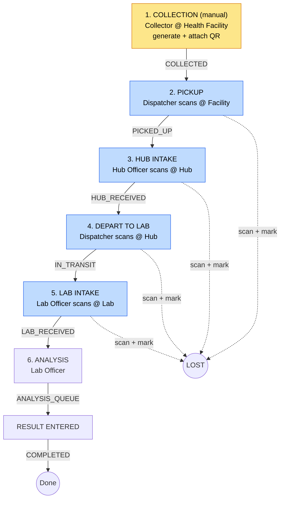

# NSRTMS — Sample Journey Flow

**Principle:** Collection is the **only** manual data-entry step. From the moment a QR
label is attached, **every subsequent stage is triggered by scanning that QR code** — the
scan, the scanner's role, and the scanner's GPS location together advance the sample to its
next state. Every scan writes one immutable `EventLog` row.

---

## Flow tree

```
                    ┌──────────────────────────────────┐
                    │  1. SAMPLE COLLECTION             │   ◀── ONLY manual step
                    │  Role:     Collector              │
                    │  Location: Health Facility        │
                    │  Action:   enter patient + sample │
                    │            data, system GENERATES │
                    │            the QR, print & attach  │
                    │  Result:   status = COLLECTED      │
                    └────────────────┬──────────────────┘
                                     │   QR now physically travels with the vial
   ══════════════════ EVERY STEP BELOW = SCAN QR → TRIGGER ACTION ══════════════════
                                     ▼
                    ┌──────────────────────────────────┐
                    │  2. PICKUP                        │
                    │  Scanned by: Dispatcher (rider)   │
                    │  Location:   Health Facility      │
                    │  Scan ▶ status = PICKED_UP         │
                    └────────────────┬──────────────────┘
                                     ▼
                    ┌──────────────────────────────────┐
                    │  3. HUB INTAKE                    │
                    │  Scanned by: Hub Officer          │
                    │  Location:   Hub                  │
                    │  Scan ▶ status = HUB_RECEIVED      │
                    └────────────────┬──────────────────┘
                                     ▼
                    ┌──────────────────────────────────┐
                    │  4. HUB → LAB DEPARTURE           │
                    │  Scanned by: Dispatcher (rider)   │
                    │  Location:   Hub                  │
                    │  Scan ▶ status = IN_TRANSIT        │
                    └────────────────┬──────────────────┘
                                     ▼
                    ┌──────────────────────────────────┐
                    │  5. LAB INTAKE                    │
                    │  Scanned by: Lab Officer          │
                    │  Location:   Laboratory           │
                    │  Scan ▶ status = LAB_RECEIVED      │
                    └────────────────┬──────────────────┘
                                     ▼
                    ┌──────────────────────────────────┐
                    │  6. ANALYSIS & RESULT             │
                    │  Role: Lab Officer                │
                    │  Scan/confirm ▶ ANALYSIS_QUEUE     │
                    │  Result entered ▶ COMPLETED        │
                    └───────────────────────────────────┘

   EXCEPTION (from any active stage):
       Scan + "Mark Lost / Damaged"  ▶  status = LOST   (terminal)

   EVERY box above writes one EventLog row:
       { event, actorId, facilityId, latitude, longitude, timestamp, metadata }
```

---

## Same flow as a diagram (Mermaid)



---

## Batches / package boxes

Individual samples can be packed into a **batch (box)** with its own QR (`BOX-…`).
A box moves through the exact same flow, but one scan acts on everything inside it:

```
Select samples ─▶ Create Batch ─▶ BOX-XXXX + box QR (print & attach)
                                        │
Scan BOX-XXXX  ─▶ manifest: lists every sample + data
               └▶ role-aware BULK advance: every sample → next stage
                  (samples not in a scannable state are skipped & reported)
```

- `POST /batches` — pack selected sampleIds into a box (generates the box QR).
- `GET /batches/scan/:batchId` — manifest (samples + data), read-only.
- `POST /batches/scan` — advance every sample in the box (one GPS-stamped log each).
- Admin console: **Batches & Boxes** page + "Create Batch" on the Samples page.
- Field app: scanning a `BOX-` code shows the manifest dialog and bulk-advances.

## What each scan records (chain of custody)

| Stage | Actor role | Location type | New status | Logged on scan |
|-------|-----------|---------------|------------|----------------|
| Collection | Collector | Health Facility | `COLLECTED` | actor, facility, time *(manual entry)* |
| Pickup | Dispatcher | Health Facility | `PICKED_UP` | actor, facility, **GPS**, time |
| Hub intake | Hub Officer | Hub | `HUB_RECEIVED` | actor, facility, **GPS**, time |
| Depart to lab | Dispatcher | Hub | `IN_TRANSIT` | actor, facility, **GPS**, time |
| Lab intake | Lab Officer | Laboratory | `LAB_RECEIVED` | actor, facility, **GPS**, time |
| Analysis | Lab Officer | Laboratory | `ANALYSIS_QUEUE` → `COMPLETED` | actor, facility, time |
| Loss/damage | any active role | any | `LOST` | actor, facility, **GPS**, time, reason |

---

## Implementation status

1. **Scan-to-advance endpoint** — ✅ built. `POST /samples/scan` looks up by `sampleId`,
   infers the next status from the scanner's **role**, validates the transition, sets the
   stage timestamp, and writes the `EventLog` **with GPS**. Wrong-role scans are rejected
   with a clear message. (`GET /samples/scan/:id` is kept for read-only look-ups.)
2. **GPS capture** — ✅ built. The scan request carries device coordinates; they are stored
   on the `EventLog` and surfaced as a Google-Maps link in the admin "Chain of Custody"
   timeline. The manual collection step correctly shows "no GPS".
3. **Hub / facility settings** — ✅ built. `GET/POST/PATCH/DELETE /facilities` + an admin
   "Facilities & Hubs" screen to create/edit a hub/lab/site and set its `type` and lat/long.
4. **Camera scanner** — ✅ built (needs on-device verification). The Flutter scan screen now
   uses `mobile_scanner` (camera) with a manual fallback; each scan calls the scan-to-advance
   endpoint with GPS from `geolocator`. Run `flutter pub get` then test on a browser/device.
